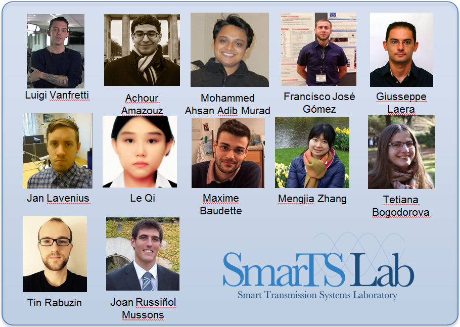

*********
Community
*********

.. toctree::
   :hidden:

   Contributing <contributing>
   License Information <copyright>
   Our Users <our-users>

The team behind the OpenIPSL is proud to share this project as an open source project.
We hope to create a strong community around this library for Power System modeling.

Let's build the future of Power System modeling.
To get involved, share your ideas, and collaborate with us, head to our :ref:`Contributing Home<contributing>`.

.. _project-contributors:

Project Contributors
====================

The iPSL
--------

The original library (iTesla Power System Library, iPSL) was developed by the consortium behind the `iTesla project`_, with the following partners:

- RTE: http://www.rte-france.com/
- AIA: http://www.aia.es/en/energy/
- SmarTS Lab, KTH: https://www.kth.se/en
- DTU: http://www.dtu.dk/english

Since the end of the iTesla project, the project has been forked into the OpenIPSL project by the SmarTS Lab research group.
Our goal is to foster a larger community and include external collaborators to the development of the library.

The OpenIPSL
------------

SmarTS Lab's people
^^^^^^^^^^^^^^^^^^^

SmarTS Lab is a research group at KTH Royal Institute of Technology, Stockholm, Sweden.
You can learn more about our research on our `departments webpage`_ or on `Luigi's website`_.
We were participating in the `iTesla project`_ and several people have contributed to this Modelica library.
Here is a complete list of the contributor (alphabetical order):

- Achour Amazouz
- Maxime Baudette
- Tetiana Bogodorova
- Francisco Gomez
- Giuseppe Laera
- Jan Lavenius
- Md. Ahsan Adib Murad
- Joan R. Mussons
- Le Qi
- Tin Rabuzin
- Luigi Vanfretti
- Mengjia Zhang

Other Collaborators
^^^^^^^^^^^^^^^^^^^

Thanks to the following people who have contributed patches, new code or given us helpful suggestions:

- Dietmar Winkler (HSN, Norway, `@dietmarw <https://github.com/dietmarw>`_)

.. _talk-to-us:

Talk to Us
==========

The team of collaborators involved in the development of the OpenIPSL can be reached at openipsl@googlegroups.com.

For more information about contributing to this repository, please head to :ref:`contributing`.

.. Links:

.. _departments webpage: https://www.kth.se/en/ees/omskolan/organisation/avdelningar/epe/research/smart-transmission-s
.. _Luigi's website: http://www.eps.ee.kth.se/personal/vanfretti/Luigi_Vanfrettis_Website/SmarTS_Lab.html
.. _iTesla project: http://www.itesla-project.eu/
